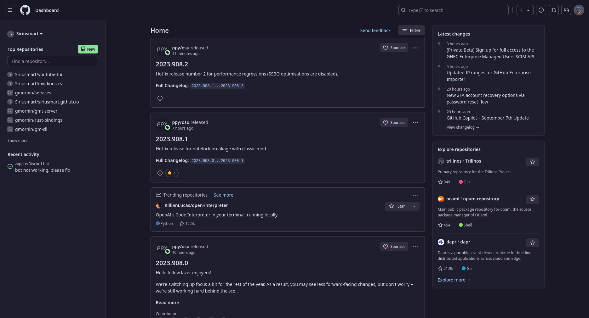
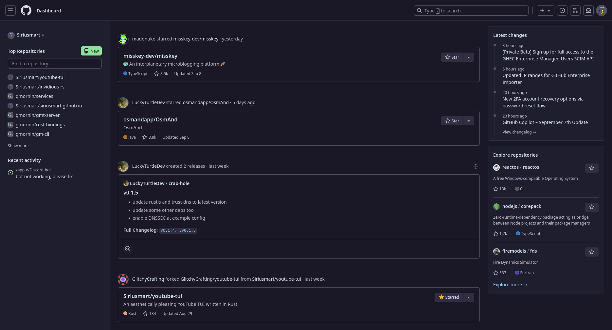

# Return GitHub Feed

[Firefox extension](https://addons.mozilla.org/firefox/addon/return-old-github-feed/)

In the current feed, no matter how many filters you have added, I can't find the information I'm interested in.  
I only care about the star and commit of people that I follow... and now I can't see that info.  
Don't the Devs that are taking care of these tasks use github?

Replace the shit💩 new feed with the old one.

<table>
  <tr><td width="50%" align="center"><b>Before (the shit💩 new feed)</b></td></tr>
  <tr>
     <td>
        

             
        

     </td>
  </tr>
  <tr><td width="50%" align="center"><b>After use (the old one)</b></td></tr>
  <tr>
     <td>
        

             
        

     </td>
  </tr>
</table>

This is a fork of [GitHub Old Feed](https://github.com/wangrongding/github-old-feed)

## License

Code released under [GPL v3](LICENSE).
